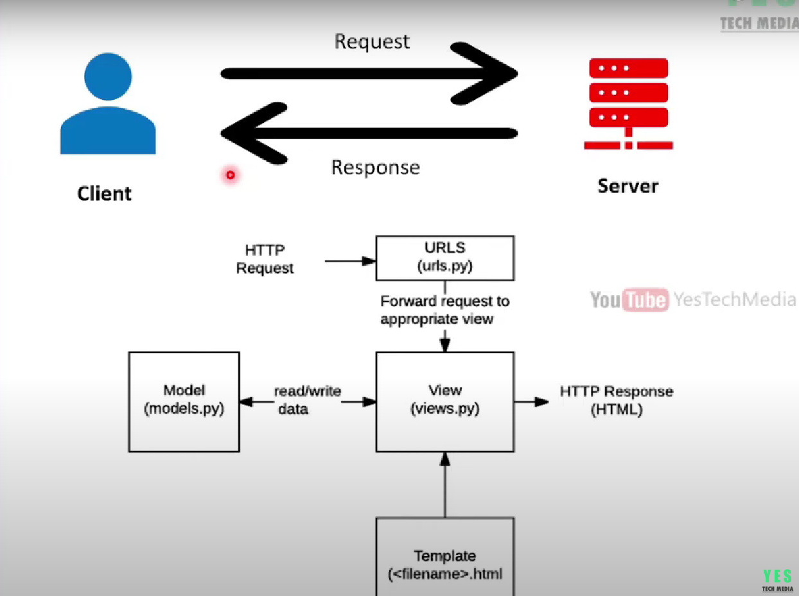
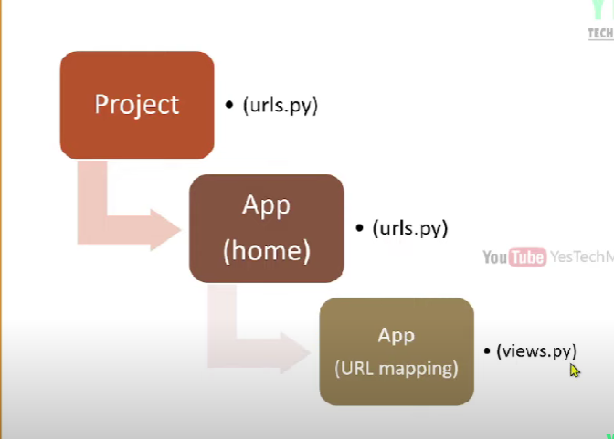

• Django is a Python web framework, that enables rapid development of secure and maintainable websites.
• Django follows the MVT design pattern (Model View Template).
• Django makes it easier to build better web apps more quickly and with less code.
• It's free and open source,

To Create Virtual Environment -- // python -m venv djenv // djenv is name of the project

To Activate Virtual Environment -- // djenv\Scipts\activate 

To Create a django project --  django-admin startproject mysite // here mysite is project name

login to project container -- cd projectname

Inside django we can create multiple pages which each page can be called as an apps

to create an app -- python manage.py startapp home // where here app name is home 

To run a django server -- python manage.py runserver 

to connect the app which we create first we go to project main project folder her it is mysite there go  to setting
then scroll down to installed apps there write appname in single quotes here the app name is " 'home', "  

----------------------------------------------------------------------------------------------------------------------------------|
                                                                                                                                  |
                                                                                                                                  | 
MODEL -- A Django model is a table in your database.                                                                              |
                                                                                                                                  |
VIEW - Django views are Python functions that takes http requests and returns http response                                       |
                                                                                                                                  |
TEMPLATE -- A template in Django is basically a html file. Django framework efficiently handles and generates dynamically         |
HTML web pages that are visible to the end-user.                                                                                  |
                                                                                                                                  |
                                                                                                                                  |
----------------------------------------------------------------------------------------------------------------------------------|

 for refrence view image

A URL (Uniform Resource Locator)  -- is a unique identifier used to locate a resource on the Internet,

Gets user requests by URL and responds back by map that route to call specified view function. To handle URL, django.urls 
module is used by the framework.

basically url mapping is connecting of diffrent app with main project urls.py file here projectname mysite and app name home

in the main project settings we need to add 

url coonecting 
-----------------------------------------------------------------------------------------------
                                       Important                                              |
                                                                                              |
we need to provide templates folder name in templates function section in settings.py   

in settings.py we need to add app name in installed app section in settings.py

 <!-- INSTALLED_APPS = [
    "django.contrib.admin",
    "django.contrib.auth",
    "django.contrib.contenttypes",
    "django.contrib.sessions",
    "django.contrib.messages",
    "django.contrib.staticfiles",
    "home",
] -->

here the home is created app 
                                                                                              |
if we are creating an app page we also need to mention url of app in urls.py in main project
folder
<!-- path("",include('home.urls') ), -->

for  include in path we need to import include from django shortcuts

in the home app we beed to create urls.py file

we need to  mention what are different paths also 

here we need to imort views from current folder

<!-- urlpatterns = [
  
    path("",views.index ),
    path("about",views.about ),
    path("booking",views.booking ),
    path("doctors",views.doctors ),
    path("contact",views.contact ),
    
] -->

<!-- def about(request):
    return HttpResponse("About Page") --> 

    function loading whithout creating an html file if we visit about path we can see that about page there

to load an html page we need to use render function

<!-- 
def index(request):
    return render(request ,"index.html") -->

also we need to import render from django shortcuts

-----------------------------------------------------------------------------------------------------------------------------------

Variables

• A template contains variables, which get replaced with values when the template is evaluated.
• We can render variables by putting them inside {{ }} brackets

Tags

• A tag, which control the logic of the template.
• If Else & For Loop
• To execute template tags, putting them inside  brackets.

with the help of this tags we can call a value in html file 

if you are defining a dictionary inside view file in app then you are passing it with calling function thereby 
you can call the values in that dictionary with {{ }} tags 

similar way you can use if with the help of 

 we can perform if else conditions

here a dictionary named number is created and it is passed in the home 

in view.py file

  
      <h2>Positive Number </h2>
    

Template inheritance allows you to build a base "skeleton" template that contains all the common elements of your site and 
defines blocks that child templates can override.

Inheritance: 
Blocks:  

in django we need to create a one base file and we can inherit the property of that base file
into all the url path we created use inheritance and block property

inorder to load url path we need to name all url path in urls.py in home app there after we need to return to html file 
usinf inheritance we need to inherit those name 

like shown as below 

 here we named doctors is inheited for reference refer home app urls.py file

django admin (superuser creation)

The administrative interface, or admin for short, allows trusted site administrators to create, edit 
and publish content, manage site users, and perform other administrative tasks.

Create an admin user:- python manage.py createsuperuser

if there is any error while creating superuser please make use of migrations

using this admin panel we can create 

users with different permissions

now let discuss -- django static files

Aside from the HTML generated by the server, web applications generally need to serve
additional files — such as images, JavaScript, or CSS — necessary to render the complete
page.

In Django, we refer to these files as "static files".

inorder to process we need to create static files folder in that main project folder

we can images folder and its files
       css    folder and its files
       js     folder and its files

inorder to process or detect static file we need to statc files path in settings.py main project folder

STATICFILES_DIRS = [
    os.path.join(BASE_DIR, 'static')
]

for adding css in base html file here use inheritance property to load static folder to 
load css files the same inheritance property

to load static folder - 

to load style sheoet - 

after that we can see the changes 

Models in django -- A Django model is a class that represents table in our Database.

Django create a database  when we create the project.

Models are defined in the app/models.py

in models 

charfield supports 255 characters

text field support more than 255 characters

to change in models we need to migrate and re run server

please note that in case of character feild we need to mention the maxlenth 

in case of text field no need to mention max length it also support more thann 255 characters

                                |
python manage.py makemigrations |
                                |
                                | we need to use all these to change take place migration in models
python manage.py migrate        |
                                |

if we need to load database in django admin panel we need to import models in admins.py folder of home

we need to call the database object also

then we just relload the admin panel 

the we can see the changes then we need to move to departmemt

then we can move to department page and make some changes

import models .in views.py folder also

we can use foreign also in models in django syntax is below

   dep_name = models.ForeignKey(Departments, on_delete=models.CASCADE) // here it refered to table departments 
   // on_delete=models.CASCADE refers to deletion dep_name deleted in refered table then her also it will be deleted 

for usage of image in django default database we can use  ImageField  demo code is shown below

doc_image = models.ImageField(upload_to='doctors')

we need to install pillow to use images in python django

for usage of folder in python django 

we need to add media root and media url demo code is shown below this is need to be placed on 
settings.py in main project folder refer end of settings.py 

MEDIA_ROOT = BASE_DIR / 'uploads'
MEDIA_URL = '/media/'

then we need to static settinngs in urls.py in main project folder

+ static(settings.MEDIA_URL, document_root = settings.MEDIA_ROOT)

for usage of this we need to import

<!-- 

from django.conf.urls.static import static
from xml.dom.minidom import Document
from django.contrib import admin
from django.conf import settings

 -->

 then we need to import all this settings 

 then we need to migrate the second model doctors which we create for this

 python manage.py makemigrations
 python manage.py migrate

 then go to admin.py file in app folder then here it is home so visit admin.py in home folder and register the Doctor model 
 we created 

 after rerun the server we can see that

while visiting the admin panel we can see it not as department name insted we can see it as object name

to fix this issue we need to create a string function in models.py

<!--

 def __str__(self):
        return self.dep_name 
        
        
        -->

a sample string function used in models.py is shown above 

after all these we need to views.py the we need  to chnages 

the create a 

